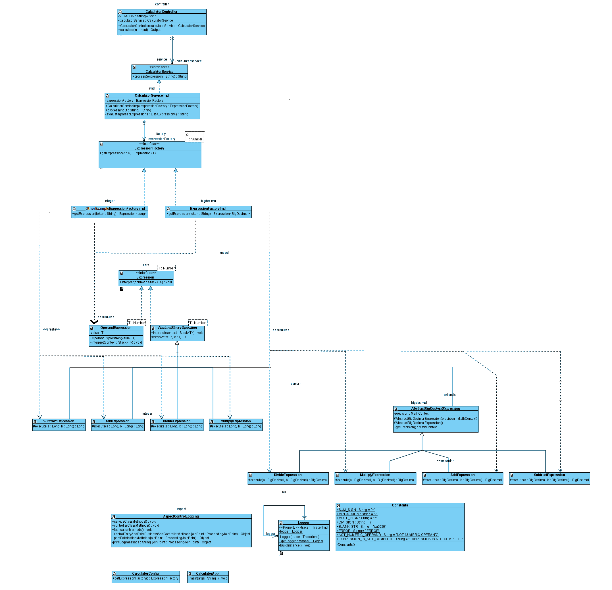

# sanitas-calculator

##Introduccion:

Este proyecto consiste en una calculadora para realizar operaciones binarias  (con dos operandos) elementales (sumas, restas) y permite la composición de las mismas.
La entrada debe ser una expresión algebraica representada en notación postfija (**rpn**) que es totalmente equivalente a la notación algebraica infija, es decir, toda expresión infija puede ser representada en notación sufija y al revés.
Esta representación es muy simple; la idea que subyace es que primero se escriben los operandos (que serán dos) y después el operador, separando cada termino por un espacio en blanco (el signo no debe separase), por ejemplo, *_3 2 +_* equivaldría a *_3+2_*, que es _5_, esta terna puede ser considerada como un operador después de resolverse de manera que se apila y si existen más operandos a la derecha (y por ende alguna operación más) se continua la evaluación.

Entonces en la expresión pueden aparecer más de dos operadores adyacentes (**3 2 6 + -**, que se resolvería primero como **2  6  +**, que sería 8, se apilaría y la evaluación continuaría con  **3 8 -**,esto es, **3 – 8 = -5**).
No es necesario tener en cuenta la preferencia de los operadores ni el uso de paréntesis dado que va implícito en la notación. Esto permitiría añadir otras operaciones como multiplicaiones, divisiones o potencia sin variar el algoritmo.

Por ejemplo **(2+5) * 4 – 1** en notación algebraica correspondería a
**2 5 + 4 * 1 –** en notación rpn; **2 ^ (3 ^ 4)** sería **2 3 4 ^ ^**, y **(2 ^ 3) ^ 4** quedaría como **2 3 ^ 4 ^**.

Expongo aquí algunos ejemplos y algoritmo que formaliza la idea anterior:
(En el primer bloque la parte izquierda del ≡ sería la representacion postfija y la de la derecha la notacion infija, en el segundo sería al revés)

    3 + 2 ≡ 3 2 +
    3 + 2 +6 ≡ 3 2 + 6 +
    3 + (2 - 6) ≡  3 2 6 - +
    (6 * (2 – 3) + 7)/(1 + 5) ≡ 6 2 3 - * 7 + 1 5 + /

    -8 5 -3 * 2 + ≡ (-8 – 5)*(-3)+ 2
    2 3 – 6 * 7 + 5 1 + / ≡  ((2-3)*6 + 7)/(5+1)
    1 2 – 4 5 ^ 3 * 6 * 7 2 2 ^ ^ / - ≡ (1-2) - ((4^5)*3*6) / 7^(2^2)

Esta notación permite una fácil evaluación de la expresiones utilizando una pila. El algoritmo formal es el que sigue:

    - Si hay elementos en la expresión de entrada:
        - Leer el primer elemento de la entrada (de izquierda a derecha).
            - Si el elemento es un operando se pone en la pila.
            - Si no, el elemento es una operación que debe tomar dos operandos
              (si hay menos de dos argumentos en la pila: Error ,no hay suficientes argumentos en la expresión)
              Se evalua la operación con respecto a los operandos e introducir el resultado en la pila.
    - Si hay un solo elemento en la pila, su valor es el resultado del cálculo (si no quedan mas operaciones en la
     entrada y hay mas de un elemento en la pila significa que se han introducido mas operandos de los necesarios
     y se devolverá un error).

##Explicación funcional:

La aplicación expone un único endpoint (http://${SERVER}:${PORT}/calculator/v1/evaluation) que tiene como entrada un json con la propiedad _expression_ como una cadena de caracteres (numericos y los signos que representan las operaciones básicas, separando cada elemento por un espacio en blanco, el signo de un operando no debe separarse del mismo) con la expresión a evaluar como sigue:

    {
        "expression": "3 2 6 - +"
    }

o en su version curl:

    curl --header "Content-Type: application/json"   --request POST   --data '{"expression": "3 2 6 - +"}'   http://localhost:8080/calculator/v1/evaluation

La evalución de la expresion se devolverá dentro de otro json (que también contendrá la entrada) en el campo _evaluatedExpression_ tal que así:

    {
        "input": {
            "expression": "3 2 6 - +"
        },
        "evaluatedExpression": "-1"
    }

Resultado de la petición curl:

      % Total    % Received % Xferd  Average Speed   Time    Time     Time  Current
                                     Dload  Upload   Total   Spent    Left  Speed
    100    92    0    65  100    27    343    142 --:--:-- --:--:-- --:--:--   489{"input":{"expression":"3 2 6 - +"},"evaluatedExpression":"-1.0"}

Si la expresión de entrada tiene algún error de sintaxis este vendrá informado en la propiedad _evaluatedExpression_ como sigue:

    {
        "input": {
            "expression": "3 2 6 - + +"
        },
        "evaluatedExpression": "EXPRESSION IS NOT COMPLETE"
    }

O bien

    {
        "input": {
            "expression": "3 2 6 - + !"
        },
        "evaluatedExpression": "NON-NUMERIC OPERAND"
    }

Si después de las evaluaciones queda más de un operando en la pila se considerará que la expresión no está completa.

## Arquitectura

###Resumen:

La aplicación puede evaluar una cadena  que representa una expresión o una composición de estas analizándola gramáticalmente y descomponiendola en expresiones que pueden manejarse computacionalmente (patrón interpreter) , estas pueden ser operaciones u operandos; los operandos (o expresiones terminales) se interpretan como valores númericos y son alamacenados en una pila, y las operaciones se interpretan sacando de la pila los operandos y aplicando el operador java correspondiente, el valor obtenido es vuelto a apilar en la pila. El último valor apilado corresponde con el resultado.
Se ha creado una factoria para la construcción de las expresiones de manera que sea sencillo cambiar los tipos (sistemas númericos) y añadir nuevas operaciones sin necesidad de hacer ningún otro cambio en el código ya escrito (patrón factory).
El control de errores y logging se lleva a cabo mediante aspectos para mantener la encapsulación de las clases y su simplicidad evitando incluir  tareas transversales en su código.

###Desarrollo

La aplicación sigue una arquitectura de dos capas, controller y service, con el siguiente diagrama de clases.

# 

El _controller_ recibe una petición http POST con un payload en su cuerpo que contiene la expression a evaluar como cadena y devuelve el mismo objeto de entrada añadiendo la porpiedad _expressionEvaluated_ con el resultado de la evaluación como cadena. Este objeto de salida es inmutable después de su construcción (patrón builder).
La cadena en la entrada se pasa a la _bean_ del servicio (ambito singleton) para que la procese (todo a traves de interfaces); esta primero separa la cadena en subcadenas utilizando el espacio en blanco como carácter separador, las subcadenas resultantes son usadas como parámetro en una factoría (inyectada en el constructor del servicio) encargada de la construcción de las expresiones. Para ello se combinan el patrón template method y el patrón factory.
El patrón _template method_ (o método plantilla) permite simplificar el código de las operaciones como sigue: todas comparten un paso común en su método _interpret()_, este es el de sacar dos valores de una pila y apilar luego el resultado de su ejecución; es esto último lo único que varía de una expresión (operación binaria) a otra, entonces se puede definir este como abstracto forzando a las clases hijas (no abstractas) a reescribir solo este paso y no todo el método _interpret()_, que aunque no tiene demasiadas lineas puede ser costoso si se añaden nuevas operaciones y/o se desea codificar las mismas con otra implementación (si los operadores no son compatibles con el tipo numérico requerido por ejemplo).

    public abstract class AbstractBinaryOperation<T extends Number> implements Expression<T> {
        @Override
        public final void interpret(final Stack<T> context) {
            final T tmp = (T) context.pop();
            context.push(execute(((T)context.pop()),tmp));
        }
        protected abstract T execute(final T a, final T b);
    }

Esto combina perfectamente con el siguiente patrón utilizado, a saber, el patrón _factory_. Originalmente la aplicación estaba solo preparada para cálculos con número enteros (_Long_) pero esto es susceptible (fácilmente) de querer modificarse si se desean por ejemplo operaciones con decimales. La solución a este problema ha sido utilizar factorias; la lógica del servicio delega la responsabilidad de la creacion de las expresiones (que representan las operaciones binarias y operandos) a una clase factoría con dos clases parametrizadas, la primera es la clase del parámetro que se usará para discriminar la instancia a construir (en este caso es la subcadena obtenida del análisis de la cadena de entrada previo) y el segundo es el tipo del sistema númerico a utilizar.

    public interface ExpressionFactory<Q,T extends Number> {
        Expression<T> getExpression(final Q q);
    }

Esto desacopla el código de la lógica del servicio de la construcción de las operaciones y sus tipos (¡que además tienen un código muy simple gracias al patrón _template method_!).

    public class AddExpression extends AbstractBinaryOperation<Long> {
        protected Long execute(final Long a, final Long b) { return a+b;}
    }

La manera de seleccionar la factoría a utilizar se lleva a cabo en la clase de configuración del contexto de Spring _CalculatorConfig_ al iniciar la aplicación. No ha sido necesarío añadir una capa más de abstracción en la factoria ya que se ha asumido que solo se usará la familia de expresiones binarias; si por ejemplo se quisieran añadir otras familias de operaciones (unarias o funciones de más de dos operandos) validas para los posibles conjuntos numéricos (aplicando polimorfismo) sería interesante aplicar el patrón abstract factory.

    @Configuration
    public class CalculatorConfig {
        @Bean
        public ExpressionFactory getExpressionFactory() {
            return new com.sanitas.calculator.service.factory.impl.integer.ExpressionFactoryImpl();
        }
    }

Si se selecciona la factoría para BigDecimal la entrada puede ser por ejemplo:

    curl --header "Content-Type: application/json"   --request POST   --data '{"expression": "3.27 2 6.15 - -"}'   http://localhost:8080/calculator/v1/evaluation

con salida (recuerdese que la expresión equivaldría a _*3.27 - (2 - 6.15)*_):

    {"input":{"expression":"3.27 2 6.15 - -"},"evaluatedExpression":"7.42"}

Por último, para el tratamiendo de excepciones y el registro de trazas de log se ha utilizado el módulo de _Spring AOP_ para la programación orientada a aspectos.
Cuando un método hace varias cosas se dice que rompe el princpio de responsabilidad única y sugiere una mala encapsulación, que un método escriba una traza de log (o lleve a cabo la gestión de posibles errores o excepciones) aparte de ejecutar las instrucciones propias para las que fue pensado podría considerarse una excepción al tratarse de tareas transversales (aspectos) comunes a muchas clases que no pueden ser encapsuladas en otra y por tanto separada del sistema, pero en el fondo no deja de ser un problema en el diseño. Una posible solución  es utilizar el patrón de diseño proxy que básicamente es una clase cuyas instancias simulan ser objetos que realmente no son, es decir, tienen una referencia al objeto real (con la misma interfaz) pero controlan el acceso a sus métodos haciendo de intermediarios, por ejemplo:

    interface EjemploInterfaz{
        void metodo();
    }
    class ObjetoReal implements EjemploInterfaz{
        void metodo(){…}
    }
    class EjemploProxyWithTraces implements EjemploInterfaz{
        private EjemploInterfaz objetoReal;
        EjemploProxyWithTraces(EjemploInterfaz o){objetoReal=o;}
        void metodo(){
            printTrace(…)
            objetoReal.metodo();
            printTrace(…)
        }
        private void printTrace(…){…}
    }

Ocurre que crear un proxy para cada clase puede ser muy costoso. Se duplicaría el número de clases dentro del propio sistema y estas seguírian encapsulando mal la funcionalidad transversal dado que no es un solo proxy el encargado de escribir las trazas. Spring AoP ofrece una verdadera solución con la misma idea pero bien implementada.
La tarea transversal encargada de escribir trazas puede ser encapsulada en una única clase que no modeliza un objeto sino un aspecto (anotacion @Aspect). Esta clase comprende los puntos de corte (@Pointcut) donde se definien que métodos del resto de clases deben interceptarse cuando se ejecuten (o justo antes, o justo después) y un metodo (@Advice) que contiene el código a ejecutar cuando esto pase.
En este caso se ha establecido que para los métodos de fabricación de las operaciones se escriba una traza con la subcadena utilizada como parametro y el tipo de instancia generada y para los métodos de negocio, los parametros de sus metodos y el retorno de los mismos:

    result :: fabrication method: getExpression input token : 8 ; instance created: com.sanitas.calculator.model.core.OperandExpression@2a9a11c0
    result :: fabrication method: getExpression input token : 2 ; instance created: com.sanitas.calculator.model.core.OperandExpression@7d63eb62
    result :: fabrication method: getExpression input token : / ; instance created: com.sanitas.calculator.model.domain.bigdecimal.DivideExpression@28667e72
    result :: business method : process; input : 8 2 / ; response: 4
    result :: business method : calculate; input : Input -> {"expression": "8 2 /"} ; response: Output -> {Input -> {"expression": "8 2 /"}, "evaluatedExpression":"4"}

El aspecto no escribe la traza por si mismo sino que utiliza una instancia _singleton_ de la clase _Logger_ que tiene un atributo de la clase _TracerImpl_ encargado de esta tarea.
Se ha hecho de esta guisa para minimizar en la medida de lo posible la construccion de objetos de la clase _TracerImpl_.
El patrón singleton es muy sencillo, se declara el constructor de la clase con el modificador de acceso privado para evitar instanciaciones externas y un atributo estatico que será la referencia a la instancia,
 además se implementa un metodo estático que se encarga de devolver la referencia anterior (si esta no apunta a un objeto creado, lo creará antes).
 Esta contruccion bajo demanda tiene el problema de que cuando aun no se ha instanciado el objeto varios hilos de ejecución
 podrían solicitarlo al mismo tiempo, obteniendo un objeto diferente entre ellos. Para evitar esto se protege el metodo de construccion con la palabra reservada 
 synchronized permitiendo que solo un hilo entre en este metodo bloqueando el resto hasta sale de el.
 Ocurre que dentro del mismo es necesario volver a evaluar si las instancia se ha creado porque puede que otro hilo
 este a la espera de entrar en el mismo método y volvería a crear la instancia. No conviene sincronizar todo el metodo por el que se obtiene
 la instancia (getLoggerInstance) dado que esto requiere muchos recursos para proteger el acceso y el problema solo ocurre la primera vez que se solicita.

        public static Logger getLoggerInstance() {
            if (logger == null) buildInstance();
            return logger;
        }
 
        private synchronized static void buildInstance() {
            if (logger == null) logger = new Logger(new TracerImpl());
        }

 El resto de llamadas independientemente de su concurrencía  siempre resolverán la evaluación como falsa y nunca entraran ya en la segunda (más costosa)

El manejo de excepciones se ha llevado a cabo para los métodos del controlador y el servicio (negocio) dado que las factorías y expresiones propagan a estos las _runtime exceptions_ que se producen.

Cuando a una operación no se le permite extraer más de un operando de la pila (si se ha quedado vacía) se lanzará una _EmptyStackException_ que el método _advice_ capturará, se construirá una respuesta con el mensaje _"EXPRESSION IS NOT COMPLETE"_.

Cuando una cadena no corresponda con un operador intentará contruirse un operando en la factoría, si este no es una cadena que pueda ser parseada se lanzará una _NumberFormatException_ y se devolverá el mensaje "NON-NUMERIC OPERAND".

Para el resto de excepciones y errores (_Throwable_), por ejemplo si se añade la operación division y al tratar de dividir por cero esta lanzaría una 
_ArithmeticException_ que se capturará devolvolviendo un mensaje de error genérico, "ERROR".

##Instalacion

Añadimos los jar proporcionados para las trazas al classplath del proyecto.
Ejecutamos el comando:

    mvn install:install-file
     -Dfile="%{FILE_PATH}\tracer-1.0.0.jar"
     -DgroupId=io.corp.calculator
     -DartifactId=tracer
     -Dversion=1.0.0
     -Dpackaging=jar

Esto incluirá los jar en la carpeta _.m2_ donde maven busca localmente las librerías que descarga.

Añadimos la dependencia maven al pom

     <dependency>
         <groupId>io.corp.calculator</groupId>
         <artifactId>tracer</artifactId>
         <version>1.0.0</version>
         <scope>compile</scope>
     </dependency>

Si se desea empaquetar el proyecto en un unico jar de manera que incluya todas las dependencias añadimos al pom.xml

      <build>
            <plugins>
                <plugin>
                    <artifactId>maven-assembly-plugin</artifactId>
                    <configuration>
                        <archive>
                            <manifest>
                                <mainClass>fully.qualified.MainClass</mainClass>
                            </manifest>
                        </archive>
                        <descriptorRefs>
                            <descriptorRef>jar-with-dependencies</descriptorRef>
                        </descriptorRefs>
                    </configuration>
                </plugin>
            </plugins>
        </build>

y ejecutamos el comando

    mvn clean compile assembly:single

Esto generará en el directorio target el archivo sanitas-calculator-1.0-SNAPSHOT-jar-with-dependencies.jar con la aplicacion completa.

